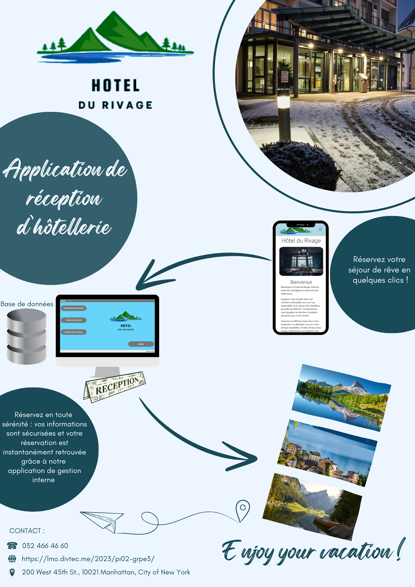
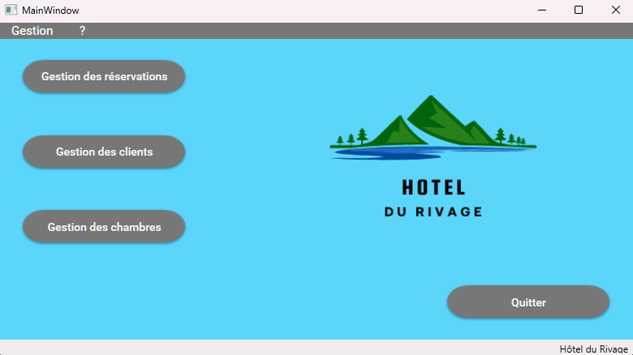
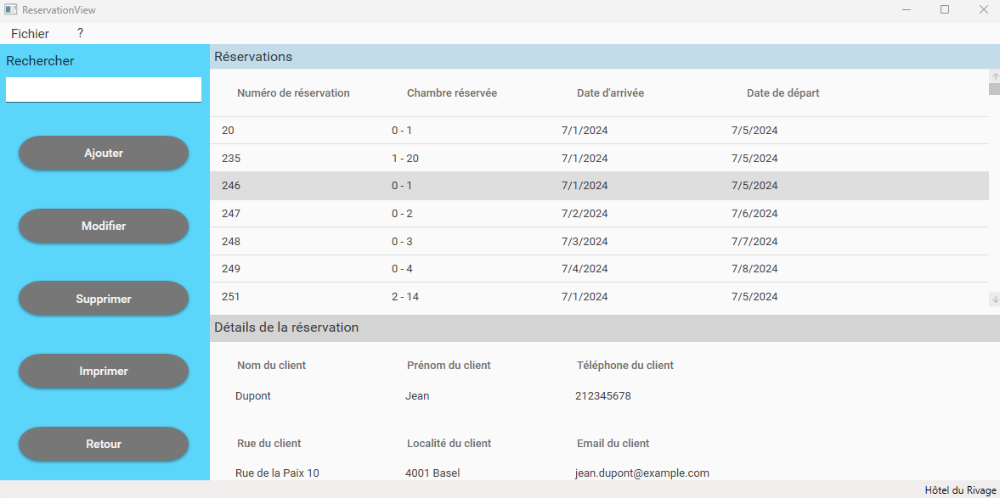
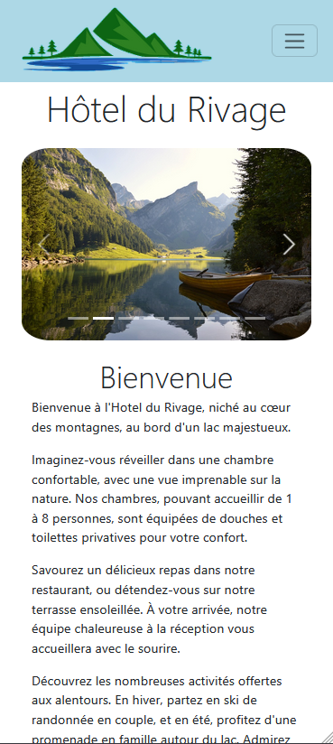
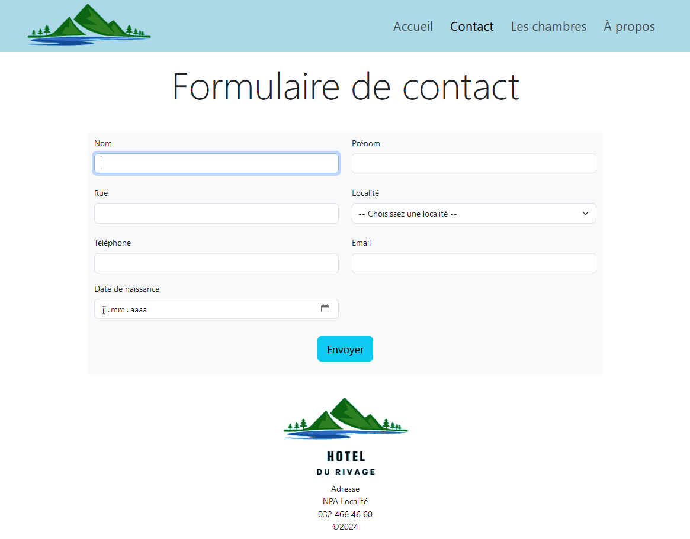
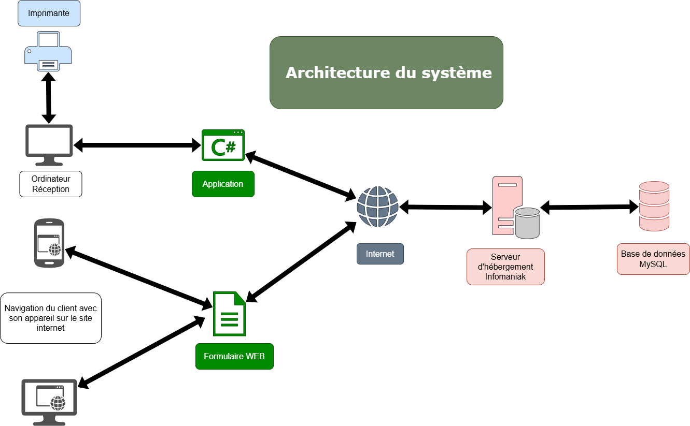
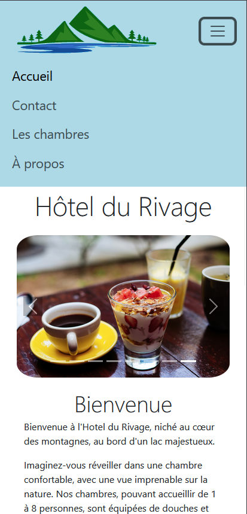
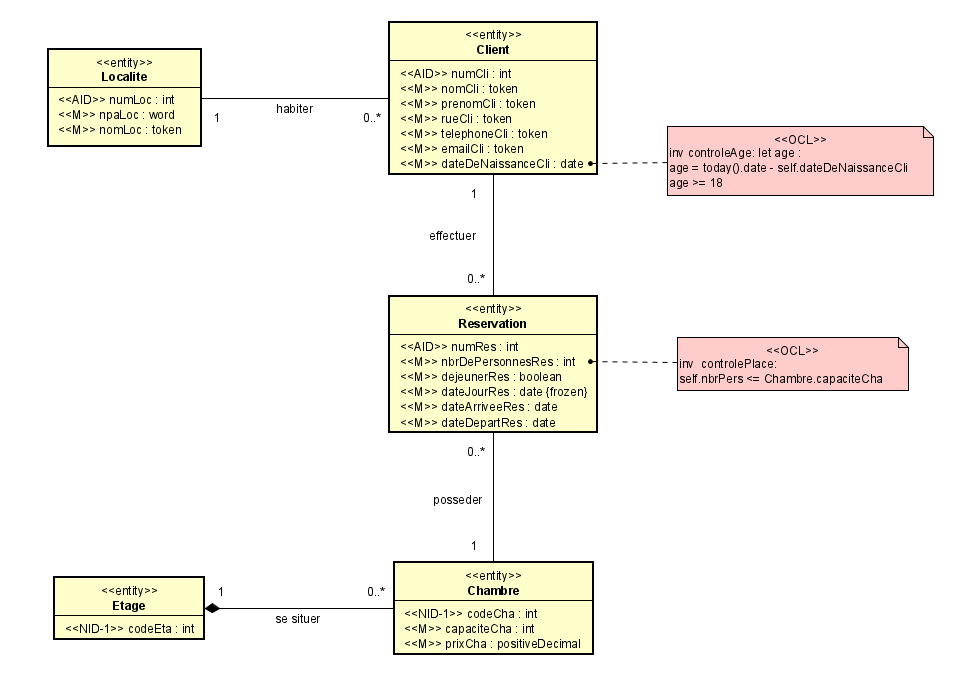

# Hôtel du Rivage - Application de Réservation


[Visiter le site internet de l'Hôtel du Rivage](https://pitarchalexandre.github.io/hotel_du_rivage_site_web/)

## Description

Ce projet a été réalisé dans le cadre de l'atelier **C822** à l'ESIG, du 13 juin 2024 au 2 juillet 2024, par **Maëlle** et **Alexandre**. Il s'agit d'une solution complète pour la gestion des réservations d'hôtel, comprenant :

- Une **application desktop** développée en **C# avec WPF** pour les réceptionnistes.
- Un **site web responsive** en **HTML5, CSS3, Bootstrap et JavaScript** pour les clients.

### Objectifs

- Mettre en avant les compétences acquises en C#, WPF, XAML, HTML, CSS et JavaScript.
- Proposer une plateforme efficace et conviviale répondant aux besoins spécifiques d'un hôtel fictif, l'**Hôtel du Rivage**.

---

## Fonctionnalités

### Application Desktop (WPF)
- Gestion des **chambres**, **clients**, **localités**, et **réservations**.
- Connexion à une base de données **MySQL** hébergée sur **Infomaniak**.
- Mise à jour en temps réel des données.




### Site Web
- Formulaire de contact sécurisé permettant aux clients de communiquer avec l'hôtel.
- Mise à jour des informations dans la base de données **MySQL** après chaque soumission de formulaire.
- Design responsive pour une expérience utilisateur optimale sur tous les appareils.




---

## Technologies Utilisées

### Backend et Base de Données
- **C#** avec **WPF** pour l'application desktop.
- **MySQL** pour le stockage des données.
- **MySQL Workbench** pour la conception et la gestion de la base de données.



### Frontend (Site Web)
- **HTML5**, **CSS3**, **Bootstrap** et **JavaScript** pour le site web.



### Gestion de Projet
- **Microsoft Teams** pour la communication et l'organisation.
- **GitHub** pour le contrôle de version (branches pour éviter les conflits).
- **GanttProject** pour le suivi des délais via un diagramme de Gantt.

---

## Conception de la Base de Données

1. Création d'un **Modèle Conceptuel de Données (MCD)**, transformé en **Modèle Logique de Données (MLD)** puis en **schéma ERD**.
2. Utilisation du **forward engineering** pour générer les tables et relations.
3. Ajout d'un **trigger** pour automatiser l'enregistrement des dates de réservation.


[Afficher le MLD](Doc/img/MLD-Hotel.PNG)
[Afficher l'ERD](Doc/img/ERD-Hotel.PNG)

---

## Défis Rencontrés

- Complexité des opérations de suppression et modification de chambres et étages à cause des dépendances entre entités.
- Gestion des clés étrangères dans la table associative des réservations.
- Temps limité pour implémenter des fonctionnalités supplémentaires telles que :
  - Une **table d'archive des réservations**.
  - L'affichage en rouge des **réservations non payées**.

---

## Résultats et Perspectives

Malgré les défis, nous avons développé une solution répondant efficacement aux besoins d'un environnement hôtelier. Pour un déploiement en conditions réelles, des fonctionnalités supplémentaires pourraient être ajoutées afin d'améliorer l'efficacité et l'utilité de la plateforme.

### Compétences Développées
- **Intégration** d'une base de données à une application.
- **Développement** d'une application WPF et d'un site web responsive.
- Collaboration avec **GitHub** et gestion de projet en équipe.
- Résolution de problèmes complexes liés à la conception de base de données et au debugging.

---

## Documentation Supplémentaire

Tout le contenu associé au projet est disponible dans le dossier **Doc** à la racine du projet. Ce dossier contient :

- Le rapport de projet.
- Des tutoriels utilisateur.
- Le PowerPoint utilisé pour la présentation et défense du projet.
- Le résumé du projet sur une page A4 (il est dans le rapport du projet).

---

## Auteurs

- **Maëlle**
- **Alexandre**

---

## Licence

Ce projet est fictif et réalisé uniquement dans le cadre d'un exercice académique.

---

## Instructions pour Faire Fonctionner l'Application

1. **Téléchargement du Projet**
   - Téléchargez le dossier **Application-Hotel**.
   - Une fois téléchargé, décompressez le fichier si nécessaire.
   - Exécutez le fichier **AP_Groupe3_Hotel.exe** pour lancer l'application desktop.

2. **Exécution de l'Application**
   - Naviguez dans le dossier **Application-Hotel**.
   - Exécutez le fichier `AP_Groupe3_Hotel.exe` pour lancer l'application.

3. **Base de Données et Site Web**
   - Notez que la base de données n'est plus en ligne et que le nom de domaine fourni dans la documentation n'existe plus.
   - Vous pouvez cependant consulter le site web sur le dépôt GitHub : [GitHub](https://github.com/esig-jura/2023-2025-c822-groupe3).

---

## Installation Locale et Test

### Prérequis
- **Visual Studio** (pour l'application desktop).
- **WebStorm** ou **Visual Studio Code** (pour le site web).
- **Laragon** ou **XAMPP** (pour simuler un serveur local).
- **MySQL Server** et **MySQL Workbench**.

### Étapes

1. Clonez le dépôt GitHub à l'aide de la commande suivante :
   ```bash
   git clone https://github.com/esig-jura/2023-2025-c822-groupe3
   ```
2. Configurez un environnement local avec **Laragon** ou **XAMPP** :
   - Placez le dossier du site web (situé dans **Web**) dans le répertoire `www` ou équivalent.
   - Démarrez le serveur local et accédez au site via `http://localhost/[nom-du-dossier]`.
3. Importez la base de données dans **MySQL Workbench** (scripts SQL non inclus pour le moment).
4. Ouvrez le projet **C#** dans **Visual Studio** (situé dans **Windows**) et configurez la chaîne de connexion MySQL si nécessaire.
5. Lancez le projet en mode Debug pour tester l'application desktop.
6. Pour le site web, ouvrez le dossier dans **WebStorm** ou **Visual Studio Code**, puis ouvrez `index.html` dans un navigateur pour tester en local.
